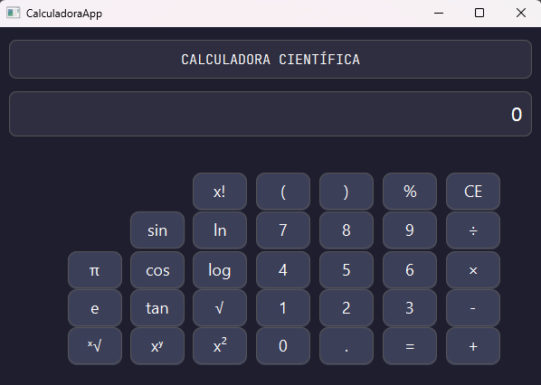

# 🧮 Simple Calculator in Java/JavaFX

This is a **Simple Calculator** built with **Java** and **JavaFX**, capable of evaluating mathematical expressions, including functions like sine, cosine, logarithms, exponents, roots, and more.

## 📸 Screenshot

 <!-- Replace with your actual image -->

---

## 🚀 Features

- ✅ Supports:
  - `+`, `-`, `*`, `/`
  - `sin`, `cos`, `tan`
  - `log`, `ln`, `√`
  - `x²`, `xʸ`, `%`, `π`, `e`
  - Factorial: `n!`
  - Nth root: `ⁿ√x` (`ˣ√`)
- ✅ Responsive button interaction
- ✅ Error handling and input validation

---

